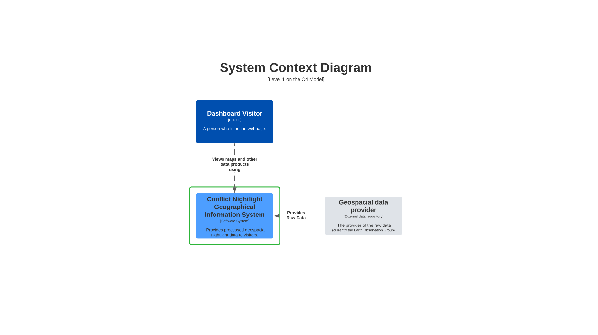
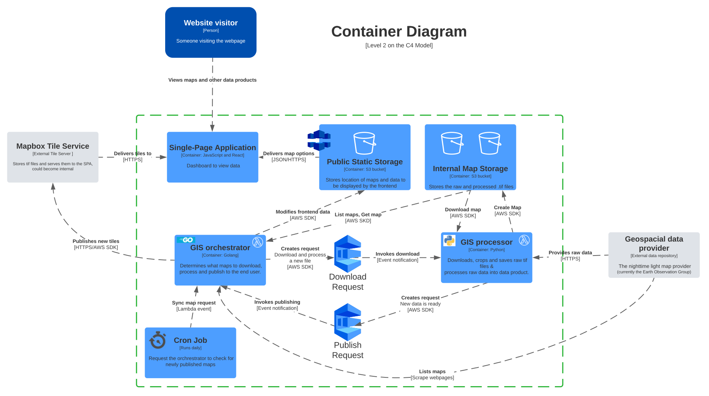

# Conflict nightlight

A full stack application for downloading, processing and displaying nightlight data.

## About

The primary purpose of this project is to showcase the effects of nightlight output due to the war in
Ukraine. Note: several studies suggest there is a strong correlation between nightlight output and GDP
(see [Henderson et. al](https://www.semanticscholar.org/paper/Measuring-Economic-Growth-from-Outer-Space-Henderson-Storeygard/6a317e73405504a7bf20536171b6059e15d07d4f?p2df) for more information.)

The secondary goals of this project are to:
- Create a service that cost less than 1 euro per month to run.
- Experiment with applying the principals of [hexagonal architecture](https://en.wikipedia.org/wiki/Hexagonal_architecture_(software)#:~:text=The%20hexagonal%20architecture%2C%20or%20ports,means%20of%20ports%20and%20adapters.) in a python codebase
- Experiment with running Golang in an aws lambda

## Architecture

## Getting started

- Set up the infrastructure with terraform in `/infra`.
- In AWS secrets manager create a new secret `conflict-nightlight-secrets` and add the following 4 key/value pairs:
  - eogdataPassword
  - eogdataUsername
  - mapboxPublicToken
  - mapboxUsername
- There is a cli for interacting with the repositories commands can be found in `lambdas/go/internal/handlers/cli.go`, to use the CLI be sure to set your export your `AWS_PROFILE`.
  - install the go dependencies with `make dependencies-install-go`
  - build the cli with `make build-cli`
  - example cli command:  `./map-controller deleteMap "{\"Date\":{\"Day\":1,\"Month\":4,\"Year\":2023}, \"MapType\":2,\"Bounds\":1}"`
